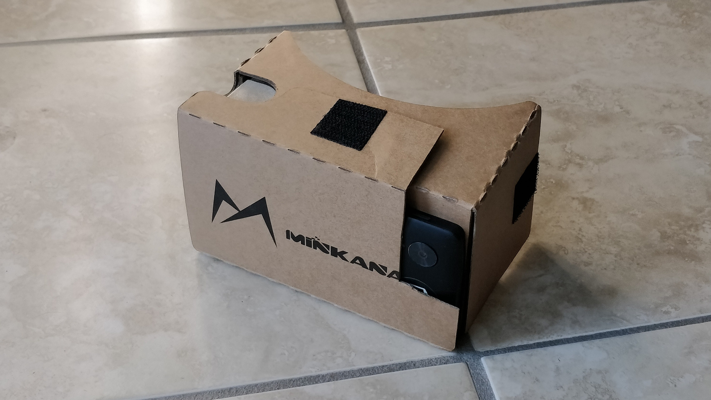

# machine-to-be-another

An amateur neuroscience experiment on visual perception using VR/AR.

The camera output from the phone is rendered on the screen. By tapping the screen (or using the main button on the VR viewer), the image is left/right mirrored.

When being worn like this, it becomes much more difficult to perform basic tasks like picking up objects, drawing pictures, and navigating.

## ☢ WARNING ☢

Take utmost caution around stairs, tripping hazards, etc. Use in a safe, controlled environment only.

## Requirements

This was built using Android Studio 2.3.3 and Gradle 3.3.

It requires a phone that supports the Google VR SDK (Android 4.4 'Kit Kat', API level 19 or higher), and a VR headset that has been modded to expose the phone camera, as shown below on a MINKANAK Google Cardboard V2:

## Acknowledgements

This project was originally a low budget implementation of The Machine To Be Another.

The code is pretty rough, as I had no experience with Android, OpenGL, or VR at the time. I used lots of code from these resources, among others:

 * http://www.learnopengles.com/android-lesson-one-getting-started/
 * https://developers.google.com/vr/android/samples/treasure-hunt
 * https://github.com/chauthai/glcam