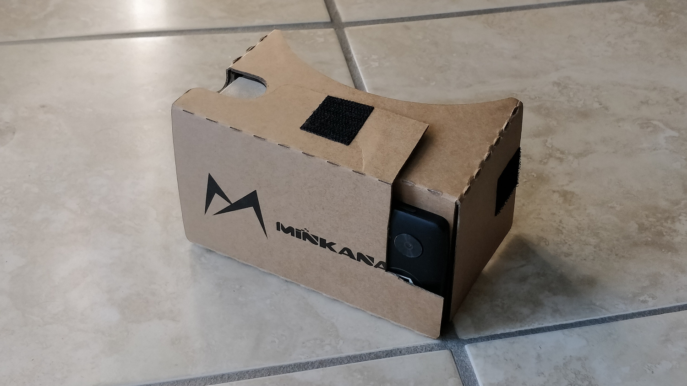

# machine-to-be-another

An amateur neuroscience experiment on visual perception using VR/AR.

The camera output from the phone is rendered on the screen. By tapping the screen (or using the main button on the VR viewer), the image is left/right mirrored.


When being worn like this, it becomes much more difficult to perform basic tasks like picking up objects, drawing pictures, and navigating.

## ☢ WARNING ☢

Take utmost caution around stairs, tripping hazards, etc. Use in a safe, controlled environment only.

## Downloading a pre-built APK

Every push (and manual run) of the **Android CI** GitHub Actions workflow builds a
debug APK. To grab it:

1. Open the **Actions** tab on GitHub and click the latest **Android CI** run.
2. Scroll to the **Artifacts** section at the bottom of the run summary.
3. Download **MachineToBeAnother-debug-apk** (a `.zip` containing `app-debug.apk`),
   unzip it, and sideload the APK onto your device.

You can also trigger a build on demand via **Actions → Android CI → Run workflow**.

## Building locally

The project uses the Gradle wrapper, so no separate Gradle install is required:

```
./gradlew assembleDebug
```

The APK is written to `app/build/outputs/apk/debug/app-debug.apk`.

## Requirements

It was originally built with Android Studio 2.3.3 / Gradle 3.3, and has since been
updated to build with a current Android Gradle Plugin (8.5) and AndroidX so it runs
on modern devices.

It requires a phone running Android 5.0 'Lollipop' (API level 21) or higher with
Google VR (Cardboard) support, and a VR headset that has been modded to expose the
phone camera, as shown below on a MINKANAK Google Cardboard V2:



## Acknowledgements

This project was originally a low budget implementation of The Machine To Be Another.

The code is pretty rough, as I had no experience with Android, OpenGL, or VR at the time. I used lots of code from these resources, among others:

 * http://www.learnopengles.com/android-lesson-one-getting-started/
 * https://developers.google.com/vr/android/samples/treasure-hunt
 * https://github.com/chauthai/glcam